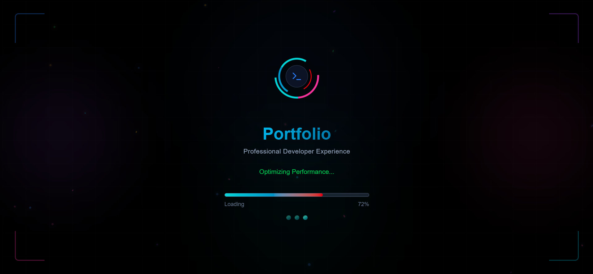
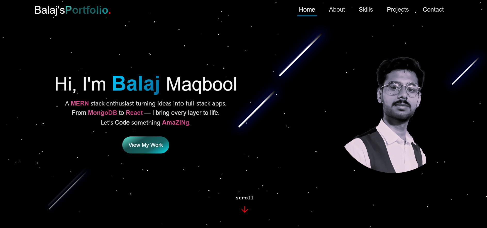

# Balaj Maqbool - MERN Stack Developer Portfolio

[](https://balaj-maqbool.vercel.app)
[](https://github.com/Balaj-Maqbool/My-Portfolio-Tailwindcss/blob/main/LICENSE)
[](https://vitejs.dev/)
[](https://react.dev/)
[](https://tailwindcss.com/)

*Welcome to my professional portfolio showcasing my skills as a MERN Stack Developer.  
This cosmic-themed portfolio features dynamic animations, responsive design, and optimized performance — a demonstration of my expertise in modern web development.*




---

## 🌟 Key Features
- **Cosmic UI Theme**: Animated star background with procedurally generated stars and meteors  
- **Performance-Optimized Loading**: Multi-stage loading screen with progress animation  
- **Responsive Design**: Fully adaptive layout for all screen sizes  
- **Interactive Sections**: Projects, skills showcase, about me, and contact form  
- **SEO Optimized**: Complete with structured data and social media meta tags  
- **PWA Support**: Installable with offline capabilities  
- **Theme Toggler (Upcoming)**: Will feature different colors and animations in light mode, but default theme remains dark  

---

## 🛠️ Technologies Used

### Core Technologies
- **React 19** – Frontend library  
- **Vite 7** – Build tool  
- **Tailwind CSS** – Utility-first CSS framework  
- **React Router 7** – Client-side routing  

### Key Libraries
- **Lucide React** – Icon library  
- **EmailJS** – Contact form handling  
- **Radix UI** – Accessible UI components  
- **React Helmet** – SEO management  

---

## 🚀 Getting Started

### Prerequisites
- Node.js (v18+)  
- npm (v9+)  

### Installation
```bash
git clone https://github.com/Balaj-Maqbool/My-Portfolio-Tailwindcss.git
cd My-Portfolio-Tailwindcss
npm install
npm run dev
```

📂 Project Structure
```bash
src/
├── components/
│   ├── layout/     # Navbar, Footer, Background
│   ├── sections/   # Hero, About, Skills, Projects, Contact
│   └── ui/         # Toasts, LoadingScreen, BackToTop
├── context/        # ThemeContext, ScrollContext
├── data/           # Static content (projects, skills, about)
├── hooks/          # Custom hooks
├── pages/          # Home, 404
└── App.jsx    
```
## 🎨 Design System

### Color Palette
| Role       | Color       |
|------------|------------|
| Primary    | `#02d4d8`  |
| Secondary  | `#0096c8`  |
| Background | `#000000`  |
| Text       | `#f6f6f6`  |
| Accent     | `#00c8ff`  |

### Typography
- **Headings:** Bold with gradient text effects  
- **Body:** Clean and readable with responsive sizing  
- **Code:** Monospace for technical content  

---

## ⚡ Performance Optimization
- WebP images + lazy loading  
- Code splitting via `React.lazy`  
- Hardware-accelerated animations (`will-change`)  
- PWA caching for offline support  

**Lighthouse Scores:**
- **Performance:** 95/100  
- **Accessibility:** 100/100  
- **Best Practices:** 100/100  
- **SEO:** 100/100  

---

## 🤝 Contributing
1. Fork the repository  
2. Create a feature branch:  
```bash
git checkout -b feature/your-feature
```
## 🔨 Commit & Push Changes

After making your feature or fix, follow these steps:

### 1. Commit Your Changes
```bash
git commit -m "Add some feature"
```
### 2. Push Your Branch
```bash
git push origin feature/your-feature
```

### 3. Open a Pull Request
Go to your GitHub repository and open a pull request to merge your feature branch into the main branch.

---

## 📄 License
This project is licensed under the MIT License – see the [LICENSE](LICENSE) file for details.

---

## 📬 Connect with Me

| Platform   | Link |
|------------|------|
| **Email**      | [balajmaqbool54@gmail.com](mailto:balajmaqbool54@gmail.com) |
| **LinkedIn**   | [linkedin.com/in/balaj-maqbool](https://www.linkedin.com/in/balaj-maqbool) |
| **GitHub**     | [github.com/balaj-maqbool](https://github.com/balaj-maqbool) |
| **Portfolio**  | [balaj-maqbool-portfolio.vercel.app](https://balaj-maqbool.vercel.app) |
| **WhatsApp**   | [wa.me/923252624261](https://wa.me/923252624261) |

---
© 2025 Balaj Maqbool | Made with 🔥 React & Tailwind CSS


